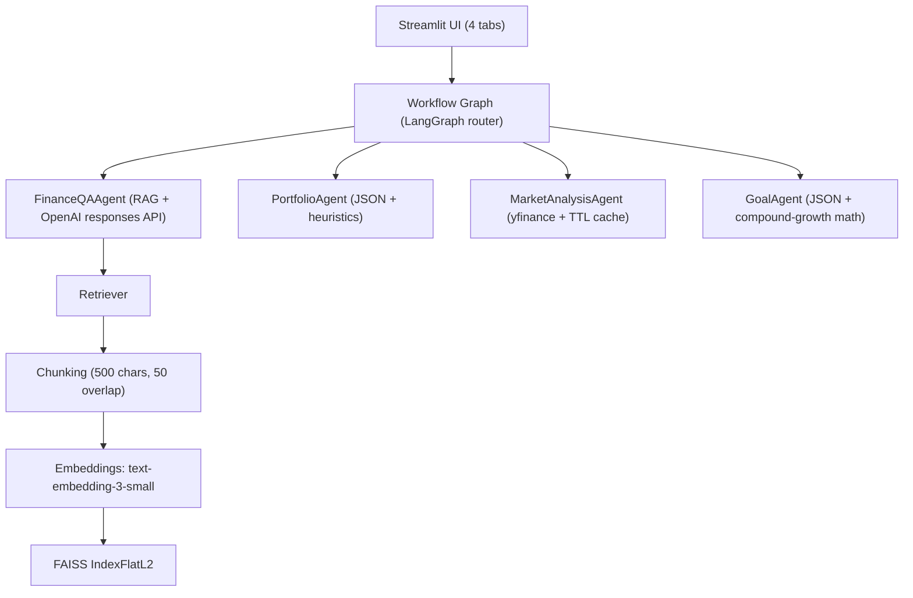

# AI Finance Assistant

A multi-agent finance assistant built with Streamlit + LangGraph + OpenAI.

This project demonstrates practical agent orchestration, retrieval-augmented generation (RAG), deterministic routing, and strong testing discipline. It is designed as an end-to-end portfolio project you can show in interviews.

## 1) What This Is

`AI Finance Assistant` helps users with four finance workflows:

- Finance Q&A (RAG-grounded beginner-friendly answers)
- Portfolio analysis (allocation, diversification, risk heuristics)
- Market lookup (ticker quote/trend summary via yfinance)
- Goal planning (monthly contribution math toward a target amount)

The app provides a tabbed UI and uses a LangGraph router to dispatch each request to the correct specialized agent.

## 2) Architecture Overview



### High-level flow

1. User submits input from Streamlit.
2. The UI sends payload to `get_graph().invoke(...)`.
3. Router chooses route (forced by tab, or keyword classifier in Chat tab).
4. Selected agent runs and returns a standard `AgentResponse`.
5. UI renders answer + sources.

## 3) Agents (What Each Does)

### `FinanceQAAgent`
- File: `src/agents/finance_qa_agent.py`
- Purpose: Explain finance concepts in simple terms using retrieved context.
- Backend: OpenAI Responses API (`gpt-4o-mini` by default via `OPENAI_FINANCE_MODEL` override).
- Notes:
  - Uses top-k retrieved text chunks as context.
  - Adds educational disclaimer to output.
  - Returns source tag currently as `["Investopedia"]` (see limitations below).

### `PortfolioAgent`
- File: `src/agents/portfolio_agent.py`
- Input: JSON object mapping ticker -> dollar amount.
- Output:
  - Total value
  - Allocation percentages
  - Diversification score (derived from HHI)
  - Risk label and triggers
- Handles malformed/invalid holdings gracefully with user-friendly errors.

### `MarketAnalysisAgent`
- File: `src/agents/market_agent.py`
- Input: Ticker-like query (example: `AAPL`, `$TSLA`)
- Output:
  - Current price
  - Day-over-day change
  - Last 5 closes
- Uses `yfinance` and in-memory TTL cache (default 30 minutes) for repeated lookups.

### `GoalAgent`
- File: `src/agents/goal_agent.py`
- Input: JSON goal payload
  - `target_amount`
  - `years`
  - `expected_annual_return`
  - optional `current_savings`
- Output: Required monthly contribution estimate with assumptions/disclaimer.

## 4) How Routing Works

Routing logic is split across UI and graph:

### A) Tab-forced routing (Portfolio/Market/Goals tabs)
- File: `src/web_app/app.py`
- The UI sets `payload["route"]` for non-chat tabs:
  - Portfolio tab -> `portfolio`
  - Market tab -> `market`
  - Goals tab -> `goal`

### B) Classifier-based routing (Chat tab)
- File: `src/workflow/graph.py` (`classify_route`)
- Used when route is not pre-set.
- Rules include:
  - Goal keywords (`goal`, `target_amount`, `expected_annual_return`, etc.) -> `goal`
  - Market keywords (`stock`, `price`, `market`, `quote`) or ticker-only regex -> `market`
  - Portfolio keywords (`portfolio`, `allocation`, `diversification`) or `{` -> `portfolio`
  - Otherwise -> `finance_qa`

### C) Router precedence
- File: `src/workflow/graph.py` (`router_node`)
- If `state.route` already exists, it is used directly.
- Else the classifier runs.

## 5) How RAG Works

Pipeline:

1. Load text docs from `documents/articles/*.txt`.
2. Chunk text into overlapping chunks:
   - `chunk_size=500`
   - `overlap=50`
3. Embed chunks with OpenAI embeddings (`text-embedding-3-small`).
4. Build FAISS `IndexFlatL2`.
5. At query time:
   - Embed query
   - Retrieve top-k chunks (`top_k=5`)
   - Pass chunks as context to `FinanceQAAgent`

Files:
- `src/rag/loader.py`
- `src/rag/vector_store.py`
- `src/rag/retriever.py`

### Source citation behavior

Current implementation surfaces a generic source label (`Investopedia`) from `FinanceQAAgent`.
If you want strict chunk-level citations, the next step is to preserve per-chunk source metadata in the retriever and return those source IDs in the agent response.

## 6) How To Run Locally

### Prerequisites

- Python 3.10+
- OpenAI API key

### Setup

```bash
git clone <your-repo-url>
cd ai-finance-assistant
python -m venv .venv
source .venv/bin/activate
pip install -r requirements.txt
```

Set environment variables:

```bash
export OPENAI_API_KEY="your_api_key_here"
# Optional: override chat model used by FinanceQAAgent
export OPENAI_FINANCE_MODEL="gpt-4o-mini"
```

Run Streamlit:

```bash
streamlit run src/web_app/app.py
```

## 7) How To Run Tests + Coverage

Run tests:

```bash
pytest -q
```

Run coverage (same command used in this project):

```bash
pytest --cov=src --cov-report=term-missing
```

Current suite includes:
- Unit tests (routing + math + sanitize/metrics)
- Contract tests (all agents return `AgentResponse` + disclaimer)
- Error handling tests (invalid ticker + malformed JSON)

## 8) Troubleshooting

### `OpenAI API key is missing` / auth errors
- Ensure `OPENAI_API_KEY` is exported in the same terminal session where Streamlit runs.
- Verify key validity and quota.

### First response feels slow
- Expected on cold start, especially Finance Q&A path (RAG index build + embeddings).
- Subsequent requests are faster, and market lookups are cached.

### Goal/Portfolio says "Please provide JSON"
- Ensure valid JSON with double quotes and proper braces.
- Example:
  - Goal: `{"target_amount": 1000000, "years": 20, "expected_annual_return": 7, "current_savings": 10000}`
  - Portfolio: `{"AAPL": 5000, "VTI": 8000, "BND": 2000}`

### Invalid ticker behavior
- If yfinance cannot fetch data, the app returns a graceful error instead of crashing.

### Dependency/build issues
- Recreate virtual environment and reinstall:
  - `rm -rf .venv`
  - `python -m venv .venv`
  - `source .venv/bin/activate`
  - `pip install -r requirements.txt`

## Additional Sections Worth Adding (Portfolio Boosters)

If you want this README to stand out further, these sections help in interviews:

- Demo scenarios: 5 sample prompts with expected behavior per agent.
- Design decisions and trade-offs: why keyword routing + deterministic tabs.
- Performance notes: cold start vs warm path latency.
- Known limitations + roadmap: what you would improve next.
- Security and responsible-use notes: educational-only, no personalized financial advice.

## Project Structure

```text
src/
  agents/
    finance_qa_agent.py
    portfolio_agent.py
    market_agent.py
    goal_agent.py
  rag/
    loader.py
    retriever.py
    vector_store.py
  workflow/
    graph.py
  web_app/
    app.py
tests/
documents/articles/
```

## Disclaimer

This project is for educational purposes only and does not constitute financial advice.
