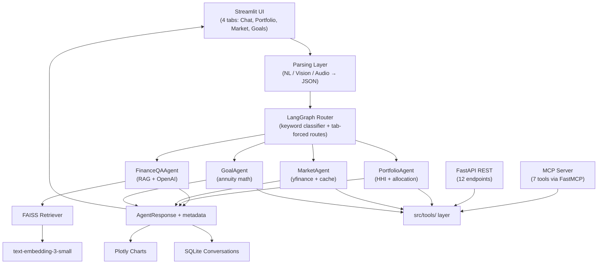

# AI Finance Assistant

A production-grade multi-agent finance assistant built with **LangGraph**, **FAISS RAG**, **OpenAI**, **Streamlit**, and **FastMCP**. Supports natural language, JSON, voice, and image input with interactive Plotly charts, persistent conversation history, and an MCP server for Claude Desktop integration.

## Features

| Feature | Description |
|---------|-------------|
| **Multi-agent orchestration** | 4 specialist agents coordinated by LangGraph StateGraph with deterministic routing |
| **RAG-grounded Q&A** | FAISS vector store over curated finance articles with source citations |
| **Multi-modal input** | Text, JSON, natural language, voice (Whisper), and brokerage screenshots (GPT-4o Vision) |
| **Interactive charts** | Plotly donut charts, bar charts, line charts, and area projections per agent |
| **Conversation history** | SQLite-backed persistent storage with sidebar navigation |
| **MCP server** | 7 tools exposed via FastMCP for Claude Desktop and other MCP clients |
| **REST API** | FastAPI with Swagger UI, 12 endpoints including NL and image parsing |
| **76 tests** | 8 test files covering tools, agents, MCP, parsing, charts, storage, and error handling |

---

## Architecture

```
User Input (text / JSON / voice / image)
    |
    v
Parsing Layer (src/tools/parsing_tools.py)
    |  OpenAI function calling / Vision API
    v  Structured JSON
LangGraph StateGraph (src/workflow/graph.py)
    |  Router node -> conditional edges
    v
    +-- FinanceQAAgent  --> FAISS RAG + OpenAI Responses API
    +-- PortfolioAgent  --> HHI diversification + risk heuristics
    +-- MarketAgent     --> yfinance + 30-min TTL cache
    +-- GoalAgent       --> Future value / annuity math
    |
    v
AgentResponse (answer + metadata)
    |
    v
Plotly Charts + SQLite Persistence + Streamlit UI
```


```mermaid
flowchart TD
    A["Streamlit UI<br/>(4 tabs: Chat, Portfolio, Market, Goals)"] --> P["Parsing Layer<br/>(NL / Vision / Audio → JSON)"]
    P --> B["LangGraph Router<br/>(keyword classifier + tab-forced routes)"]
    B --> C["FinanceQAAgent<br/>(RAG + OpenAI)"]
    B --> D["PortfolioAgent<br/>(HHI + allocation)"]
    B --> E["MarketAgent<br/>(yfinance + cache)"]
    B --> F["GoalAgent<br/>(annuity math)"]
    C --> G["FAISS Retriever"]
    G --> H["text-embedding-3-small"]
    C --> R["AgentResponse + metadata"]
    D --> R
    E --> R
    F --> R
    R --> CH["Plotly Charts"]
    R --> DB["SQLite Conversations"]
    R --> A

    MCP["MCP Server<br/>(7 tools via FastMCP)"] --> TL["src/tools/ layer"]
    API["FastAPI REST<br/>(12 endpoints)"] --> TL
    D --> TL
    E --> TL
    F --> TL
```

### Key Layers

| Layer | Path | Purpose |
|-------|------|---------|
| **Tools** | `src/tools/` | Pure reusable functions shared by agents, MCP server, and API |
| **Agents** | `src/agents/` | 4 specialist agents implementing `Agent` Protocol → `AgentResponse` |
| **Workflow** | `src/workflow/graph.py` | LangGraph StateGraph with router node and conditional edges |
| **Parsing** | `src/tools/parsing_tools.py` | NL-to-JSON (OpenAI function calling), image-to-JSON (GPT-4o Vision) |
| **Storage** | `src/storage/` | SQLite conversation persistence with WAL mode |
| **Charts** | `src/web_app/components/charts.py` | Plotly chart builders for each agent type |
| **UI** | `src/web_app/` | Streamlit component architecture (sidebar, tabs, audio, upload) |
| **MCP** | `src/mcp/server.py` | FastMCP server exposing 7 finance tools |
| **API** | `src/api/main.py` | FastAPI with 12 REST endpoints |

---

## Agents

### FinanceQAAgent
- **File:** `src/agents/finance_qa_agent.py`
- **Purpose:** Answer finance questions using RAG-grounded context
- **Backend:** OpenAI Responses API (`gpt-4o-mini` default, configurable via `OPENAI_FINANCE_MODEL`)
- **Flow:** Query → embed → retrieve top-5 chunks from FAISS → generate answer with citations
- **Output:** Educational explanation with source citations and disclaimer

### PortfolioAgent
- **File:** `src/agents/portfolio_agent.py`
- **Input:** JSON `{"AAPL": 5000, "VTI": 8000}` or natural language or screenshot
- **Processing:** Sanitize holdings → compute HHI → allocation percentages → risk classification → asset mix
- **Output:** Markdown report + `metadata` (allocations, risk, diversification_score, stock/bond/other pct)
- **Charts:** Allocation donut chart + asset mix bar chart

### MarketAgent
- **File:** `src/agents/market_agent.py`
- **Input:** Ticker symbol (e.g., `AAPL`, `$TSLA`) or natural language
- **Processing:** Extract ticker → fetch via yfinance → compute day change → cache (30-min TTL)
- **Output:** Price summary + `metadata` (ticker, last_5_closes)
- **Charts:** Price history line chart

### GoalAgent
- **File:** `src/agents/goal_agent.py`
- **Input:** JSON `{"target_amount": 1000000, "years": 20, ...}` or natural language
- **Processing:** Validate → normalize return rate → future value annuity formula → solve for PMT
- **Output:** Monthly contribution estimate + `metadata` (monthly_contribution, months, rates)
- **Charts:** Projected savings growth area chart

---

## Routing

Three-tier routing with clear precedence:

1. **Tab-forced** (highest priority): Portfolio/Market/Goals tabs set `payload["route"]` directly
2. **Keyword classifier** (`classify_route()` in `graph.py`): Pattern matching for goal, market, portfolio keywords
3. **Default fallback**: Routes to `finance_qa` for general questions

The Chat tab uses classifier-based routing; all other tabs force their respective agent.

---

## Input Modes

| Tab | JSON | Natural Language | Voice | Screenshot |
|-----|------|-----------------|-------|------------|
| Chat | — | Direct text input | Mic button | — |
| Portfolio | `{"AAPL": 5000}` | "I have $5k in Apple" | Mic → NL parse | Brokerage screenshot |
| Market | — | Ticker or question | Mic button | — |
| Goals | `{"target_amount": 1M}` | "Save $1M in 20 years" | Mic → NL parse | — |

**Parsing pipeline:** Voice → Whisper transcription → NL text → OpenAI function calling → JSON → agent

---

## RAG Pipeline

1. Load 6 curated `.txt` articles from `documents/articles/`
2. Chunk at 500 chars with 50-char overlap
3. Embed with OpenAI `text-embedding-3-small`
4. Store in FAISS `IndexFlatL2`
5. At query time: embed query → retrieve top-5 chunks → pass as context to LLM

**Knowledge base topics:** ETFs, stocks, bonds, diversification, asset allocation, three-fund portfolio

---

## MCP Server

Exposes 7 tools via FastMCP for use in Claude Desktop and other MCP clients:

| Tool | Description |
|------|-------------|
| `analyze_portfolio` | Full portfolio analysis from holdings dict |
| `compute_portfolio_risk` | Machine-readable metrics dict |
| `plan_savings_goal` | Monthly savings calculation |
| `get_stock_quote` | Current price + last 5 closes |
| `search_finance_knowledge` | RAG search over knowledge base |
| `parse_portfolio_description` | NL text → portfolio analysis |
| `parse_goal_description` | NL text → savings plan |

**Run:** `python -m src.mcp.server`

**Claude Desktop config** (`claude_desktop_config.json`):
```json
{
  "mcpServers": {
    "ai-finance-assistant": {
      "command": "python",
      "args": ["-m", "src.mcp.server"],
      "cwd": "/path/to/ai-finance-assistant",
      "env": { "OPENAI_API_KEY": "sk-..." }
    }
  }
}
```

---

## REST API

12 endpoints via FastAPI with auto-generated Swagger UI at `/docs`.

| Method | Path | Description |
|--------|------|-------------|
| GET | `/health` | Liveness check |
| POST | `/api/chat` | General chat with auto-routing |
| GET | `/api/market/{ticker}` | Stock quote for a ticker |
| POST | `/api/portfolio` | Portfolio analysis from JSON |
| POST | `/api/portfolio/natural` | Portfolio from NL description |
| POST | `/api/portfolio/image` | Portfolio from screenshot (base64) |
| POST | `/api/goals` | Goal calculation from JSON |
| POST | `/api/goals/natural` | Goal from NL description |
| GET | `/api/conversations` | List conversation history |
| GET | `/api/conversations/{id}` | Get conversation with messages |

**Run:** `uvicorn src.api.main:app --port 8000`

---

## Getting Started

### Prerequisites

- Python 3.10+
- OpenAI API key

### Setup

```bash
git clone <your-repo-url>
cd ai-finance-assistant
python -m venv .venv
source .venv/bin/activate
pip install -r requirements.txt
```

### Environment

```bash
export OPENAI_API_KEY="your_api_key_here"
# Optional: override model (defaults to gpt-4o-mini)
export OPENAI_FINANCE_MODEL="gpt-4o-mini"
```

### Run

```bash
# Streamlit UI
streamlit run src/web_app/app.py

# REST API (separate terminal)
uvicorn src.api.main:app --port 8000

# MCP server (for Claude Desktop)
python -m src.mcp.server
```

---

## Testing

```bash
# Run all tests
pytest -q

# Run with coverage
pytest --cov=src --cov-report=term-missing

# Run a specific test file
pytest tests/test_tools.py -v
```

### Test Suite (76 tests across 8 files)

| File | Tests | Covers |
|------|-------|--------|
| `test_unit_routing_and_math.py` | Portfolio metrics, goal math, routing classifier |
| `test_contracts.py` | All agents return valid `AgentResponse` with disclaimers |
| `test_error_handling.py` | Invalid inputs, malformed JSON, graceful errors |
| `test_tools.py` | All `src/tools/` functions (portfolio, goal, market, RAG) |
| `test_mcp_server.py` | MCP tool functions called directly |
| `test_parsing.py` | NL and image parsing with mocked OpenAI calls |
| `test_conversation_db.py` | SQLite CRUD with in-memory DB |
| `test_charts.py` | Chart functions return valid Plotly figures |

Coverage target: 80%+ overall, 90%+ for core logic.

---

## Project Structure

```
src/
  agents/
    base.py                    # AgentResponse dataclass + Agent Protocol
    finance_qa_agent.py        # RAG-grounded Q&A
    portfolio_agent.py         # HHI diversification analysis
    market_agent.py            # yfinance market data
    goal_agent.py              # Annuity/FV goal planning
  tools/
    portfolio_tools.py         # Pure portfolio functions (sanitize, metrics, format)
    goal_tools.py              # Pure goal functions (validate, compute, format)
    market_tools.py            # Pure market functions (extract, fetch, format)
    rag_tools.py               # RAG retrieval wrapper
    parsing_tools.py           # NL-to-JSON and image-to-JSON parsing
    audio_tools.py             # Whisper transcription
  workflow/
    graph.py                   # LangGraph StateGraph + routing
  rag/
    loader.py                  # Document loader
    retriever.py               # FAISS retriever
    vector_store.py            # FAISS index builder
  storage/
    models.py                  # Pydantic models (Conversation, Message)
    conversation_db.py         # SQLite CRUD (WAL mode)
  web_app/
    app.py                     # Streamlit entry point (~90 lines)
    components/
      sidebar.py               # Conversation history + branding
      chat_tab.py              # Chat tab with audio
      portfolio_tab.py         # Portfolio: JSON / NL / Screenshot / Voice
      market_tab.py            # Market: text + voice
      goals_tab.py             # Goals: JSON / NL / Voice
      charts.py                # Plotly chart builders
      audio_input.py           # Mic button + Whisper
      file_upload.py           # Image/PDF upload widget
      _shared.py               # render_messages, run_query, save_message_pair
    styles/
      theme.py                 # Additive CSS generation
      custom.css               # Static CSS overrides
  mcp/
    server.py                  # FastMCP server (7 tools)
  api/
    main.py                    # FastAPI REST API (12 endpoints)
  utils/
    cache.py                   # TTL in-memory cache
    config.py                  # Environment config
tests/
  test_unit_routing_and_math.py
  test_contracts.py
  test_error_handling.py
  test_tools.py
  test_mcp_server.py
  test_parsing.py
  test_conversation_db.py
  test_charts.py
documents/
  articles/                    # 6 curated finance articles for RAG
data/
  conversations.db             # SQLite DB (auto-created, gitignored)
```

---

## Troubleshooting

### OpenAI API key errors
Ensure `OPENAI_API_KEY` is exported in the same terminal session. Verify key validity and quota.

### First response is slow
Expected on cold start — RAG index build + embeddings load. Subsequent requests are faster, and market lookups are cached (30-min TTL).

### Portfolio/Goal says "Please provide JSON"
If using JSON mode, ensure valid JSON with double quotes:
- Portfolio: `{"AAPL": 5000, "VTI": 8000, "BND": 2000}`
- Goal: `{"target_amount": 1000000, "years": 20, "expected_annual_return": 7}`

Or switch to **Natural Language** mode and describe in plain text.

### Audio input not working
- Allow microphone access in your browser when prompted
- Ensure `audio-recorder-streamlit` is installed: `pip install audio-recorder-streamlit`
- Requires `OPENAI_API_KEY` for Whisper transcription

### Invalid ticker
yfinance returns a graceful error message instead of crashing.

### Dependency issues
```bash
rm -rf .venv
python -m venv .venv
source .venv/bin/activate
pip install -r requirements.txt
```

---

## Design Decisions

| Decision | Rationale |
|----------|-----------|
| **Keyword routing over LLM routing** | Deterministic, fast, testable; tabs already force routes for 3/4 agents |
| **Tools layer separated from agents** | Pure functions shared across agents, MCP, and API without duplication |
| **Array-based OpenAI function calling schema** | `additionalProperties` doesn't work reliably with gpt-4o-mini; arrays are more robust |
| **Audio dedup via MD5 hash** | Streamlit reruns re-emit last audio bytes; hash prevents infinite transcribe loops |
| **Additive-only CSS** | Avoids fighting Streamlit's native theming; works in both light and dark mode |
| **SQLite with WAL mode** | Lightweight, zero-config; WAL allows concurrent reads from Streamlit sessions |
| **AgentResponse.metadata** | Carries structured chart data alongside markdown answer without breaking backward compat |

---

## Disclaimer

This project is for educational purposes only and does not constitute financial advice. All projections are simplified and based on static assumptions.
