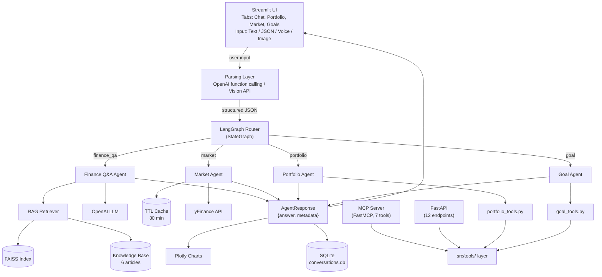
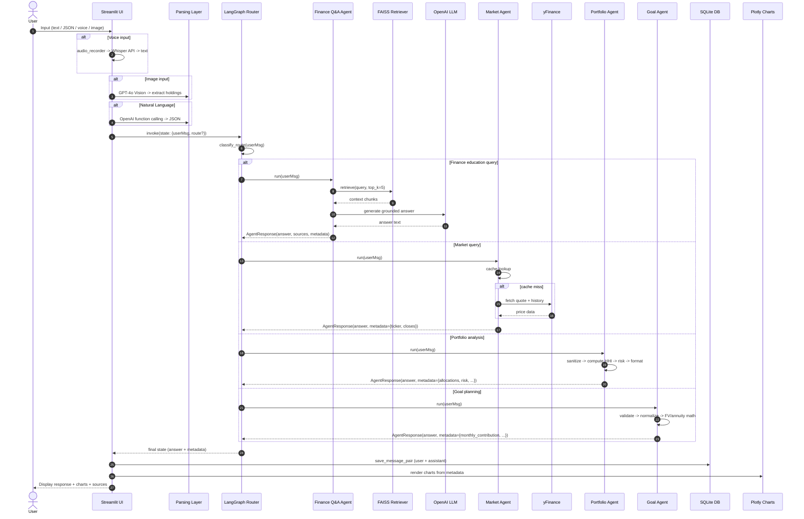

# AI Finance Assistant -- Technical Specification

## 1. Overview

The AI Finance Assistant is a multi-agent financial education and analysis system. It accepts input in multiple modalities (text, JSON, voice, images), routes queries to specialist agents via a LangGraph StateGraph, and returns structured responses with interactive Plotly charts and persistent conversation history.

### Technology Stack

| Component | Technology |
|-----------|-----------|
| LLM | OpenAI GPT-4o-mini (configurable via `OPENAI_FINANCE_MODEL`) |
| Orchestration | LangGraph StateGraph with conditional edges |
| RAG | FAISS `IndexFlatL2` + OpenAI `text-embedding-3-small` |
| Market Data | yfinance with 30-min TTL cache |
| NL Parsing | OpenAI function calling (tool_choice) |
| Image Parsing | GPT-4o Vision API |
| Voice Input | OpenAI Whisper API |
| UI | Streamlit (component architecture) |
| Charts | Plotly (donut, bar, line, area) |
| Persistence | SQLite with WAL mode |
| MCP | FastMCP server (7 tools) |
| REST API | FastAPI (12 endpoints) |
| Testing | pytest (76 tests, 8 files) |

### System Capabilities

1. **Finance Q&A** -- RAG-grounded educational answers with source citations
2. **Portfolio Analysis** -- Allocation, diversification (HHI), risk heuristics, asset mix classification
3. **Market Lookup** -- Real-time stock quotes via yfinance with caching
4. **Goal Planning** -- Monthly contribution calculation using future value / annuity math
5. **Multi-modal Input** -- JSON, natural language, voice (Whisper), brokerage screenshots (Vision)
6. **Interactive Charts** -- Donut, bar, line, and area charts for each agent
7. **Conversation History** -- SQLite-backed persistence with sidebar navigation
8. **MCP Integration** -- Claude Desktop can invoke 7 finance tools directly
9. **REST API** -- 12 FastAPI endpoints with Swagger UI

---

## 2. Architecture

### 2.1 System Architecture

```
User Input (text / JSON / voice / image)
    |
    v
Parsing Layer                          MCP Server (FastMCP)
  src/tools/parsing_tools.py              src/mcp/server.py
  - parse_portfolio_from_text()           - 7 tools for Claude Desktop
  - parse_goal_from_text()
  - parse_portfolio_from_image()
    |                                  REST API (FastAPI)
    v  Structured JSON                    src/api/main.py
                                          - 12 endpoints
Tools Layer (src/tools/)
  - portfolio_tools.py                 <-- shared by all consumers
  - goal_tools.py
  - market_tools.py
  - rag_tools.py
    |
    v
Agent Layer (src/agents/)
  - FinanceQAAgent   --> RAG retriever --> OpenAI LLM
  - PortfolioAgent   --> portfolio_tools
  - MarketAgent      --> market_tools + yfinance
  - GoalAgent        --> goal_tools
    |
    v
Workflow Layer (src/workflow/graph.py)
  - LangGraph StateGraph
  - Router node (classify_route)
  - Conditional edges to agent nodes
    |
    v
AgentResponse { answer, metadata }
    |
    v
Presentation Layer (src/web_app/)
  - Plotly charts (from metadata)
  - SQLite persistence (src/storage/)
  - Streamlit component UI
```

### 2.2 Architecture Diagrams



### 2.3 Sequence Diagram



---

## 3. Core Interfaces

### 3.1 Agent Protocol

All agents implement a shared interface:

```python
class Agent(Protocol):
    name: str
    def run(self, query: str) -> AgentResponse
```

### 3.2 AgentResponse

```python
@dataclass
class AgentResponse:
    answer: str                          # Markdown formatted response
    agent_name: str                      # Agent identifier
    confidence: str = "medium"           # "low" | "medium" | "high"
    sources: list[str] | None = None     # Citation labels
    metadata: dict | None = None         # Structured data for charts
```

The `metadata` field carries chart data:
- **Portfolio:** `{allocations, risk, diversification_score, stock_pct, bond_pct, other_pct, triggers}`
- **Market:** `{ticker, last_5_closes}`
- **Goals:** `{monthly_contribution, months, monthly_rate, target_amount, current_savings, annual_return_decimal}`

### 3.3 GraphState

```python
@dataclass
class GraphState:
    userMsg: str = ""
    route: Route | None = None
    answer: str = ""
    agent_name: str = ""
    confidence: str = ""
    sources: List[str] = field(default_factory=list)
    history: List[Tuple[str, AgentResponse]] = field(default_factory=list)
    metadata: dict = field(default_factory=dict)
    conversation_history: list[dict] = field(default_factory=list)
```

---

## 4. Agent Specifications

### 4.1 Finance Q&A Agent (RAG)

**File:** `src/agents/finance_qa_agent.py`

| Aspect | Detail |
|--------|--------|
| Input | Natural language question |
| Processing | Query -> embed -> retrieve top-5 FAISS chunks -> LLM with grounded prompt |
| Output | Educational answer with source citations and disclaimer |
| Model | `gpt-4o-mini` (configurable via `OPENAI_FINANCE_MODEL`) |
| Failure mode | "I don't have enough information" when no relevant context found |

### 4.2 Portfolio Analysis Agent

**File:** `src/agents/portfolio_agent.py`
**Tools:** `src/tools/portfolio_tools.py`

| Aspect | Detail |
|--------|--------|
| Input | JSON `{"AAPL": 5000, "VTI": 8000}` (after parsing) |
| Processing | Sanitize -> compute allocation % -> HHI -> diversification score (0-100) -> risk band -> asset mix |
| Output | Markdown report + metadata for donut and bar charts |
| Risk logic | High: concentration > threshold or stock-heavy; Medium: moderate concentration; Low: broad allocation |
| Asset classification | STOCK_KEYWORDS and BOND_KEYWORDS sets for ticker classification |

**Metadata schema:**
```json
{
  "allocations": {"AAPL": 33.3, "VTI": 53.3, "BND": 13.3},
  "diversification_score": 72,
  "risk": "medium",
  "triggers": ["Moderate concentration in top holdings"],
  "stock_pct": 86.7,
  "bond_pct": 13.3,
  "other_pct": 0.0
}
```

### 4.3 Market Analysis Agent

**File:** `src/agents/market_agent.py`
**Tools:** `src/tools/market_tools.py`

| Aspect | Detail |
|--------|--------|
| Input | Ticker symbol (e.g., `AAPL`, `$TSLA`) |
| Processing | Extract ticker -> cache check -> yfinance fetch -> compute day change % |
| Output | Price summary + metadata for line chart |
| Cache | In-memory TTL cache (30 minutes default) |
| Error handling | Invalid ticker -> graceful message; API failure -> friendly fallback |

**Metadata schema:**
```json
{
  "ticker": "AAPL",
  "last_5_closes": [189.50, 190.25, 188.75, 191.00, 192.30]
}
```

### 4.4 Goal Planning Agent

**File:** `src/agents/goal_agent.py`
**Tools:** `src/tools/goal_tools.py`

| Aspect | Detail |
|--------|--------|
| Input | JSON `{"target_amount": 1000000, "years": 20, "expected_annual_return": 7, "current_savings": 10000}` |
| Processing | Validate -> normalize return (7 -> 0.07) -> FV annuity formula -> solve for PMT |
| Output | Monthly contribution estimate + metadata for area chart |
| Formula | `FV = PV(1+r)^n + PMT * [((1+r)^n - 1) / r]`, solve for PMT |
| Edge cases | Zero return, already-funded goal, negative values |

**Metadata schema:**
```json
{
  "monthly_contribution": 2164.31,
  "months": 240,
  "monthly_rate": 0.005654,
  "target_amount": 1000000,
  "current_savings": 10000,
  "annual_return_decimal": 0.07
}
```

---

## 5. Tools Layer

Pure functions extracted from agents into `src/tools/` for reuse across agents, MCP server, and REST API.

### 5.1 portfolio_tools.py

| Function | Purpose |
|----------|---------|
| `sanitize_holdings(holdings)` | Filter valid ticker:amount pairs, strip `$`, uppercase keys |
| `compute_portfolio_metrics(holdings)` | HHI, diversification score, risk band, asset mix |
| `format_portfolio_report(metrics)` | Markdown report with allocation table, risk triggers |

### 5.2 goal_tools.py

| Function | Purpose |
|----------|---------|
| `validate_and_normalize_goal(payload)` | Validate required fields, normalize return (7 -> 0.07) |
| `compute_monthly_contribution(normalized)` | FV annuity math |
| `format_goal_report(result)` | Markdown report with contribution and assumptions |

### 5.3 market_tools.py

| Function | Purpose |
|----------|---------|
| `extract_ticker(query)` | Regex extraction of ticker from free text |
| `get_quote_and_history(ticker)` | Raw yfinance fetch |
| `get_market_data(ticker, cache?)` | Cache-aware wrapper |
| `format_market_report(ticker, data)` | Markdown report with price and trend |

### 5.4 rag_tools.py

| Function | Purpose |
|----------|---------|
| `retrieve_finance_context(query, top_k=5)` | FAISS similarity search wrapper (lazy singleton) |

### 5.5 parsing_tools.py

| Function | Input | Output | Backend |
|----------|-------|--------|---------|
| `parse_portfolio_from_text(text)` | NL description | `dict` or error `str` | OpenAI function calling (array schema) |
| `parse_goal_from_text(text)` | NL description | `dict` or error `str` | OpenAI function calling |
| `parse_portfolio_from_image(base64)` | Base64 image | `dict` or error `str` | GPT-4o Vision API |

All parsing functions pass through valid JSON unchanged (backward compatible).

**Array schema design choice:** Uses `[{ticker, amount}]` instead of `additionalProperties: {type: number}` because gpt-4o-mini returns empty objects with the latter format.

### 5.6 audio_tools.py

| Function | Input | Output | Backend |
|----------|-------|--------|---------|
| `transcribe_audio(audio_bytes)` | Raw audio bytes (WAV) | Transcribed text or `None` | OpenAI Whisper API |

---

## 6. Routing Logic

### 6.1 Three-Tier Routing

| Priority | Mechanism | Source |
|----------|-----------|--------|
| 1 (highest) | Tab-forced route | UI sets `payload["route"]` for Portfolio/Market/Goals tabs |
| 2 | Keyword classifier | `classify_route()` in `graph.py` |
| 3 (default) | Fallback | Routes to `finance_qa` |

### 6.2 Keyword Classifier Rules

| Pattern | Route |
|---------|-------|
| Goal keywords: `goal`, `target_amount`, `expected_annual_return`, `years` | `goal` |
| Market keywords: `stock`, `price`, `market`, `quote`, ticker regex | `market` |
| Portfolio keywords: `portfolio`, `allocation`, `diversification`, `{` | `portfolio` |
| Everything else | `finance_qa` |

### 6.3 Router Node

```python
def router_node(state: GraphState) -> Dict[str, Any]:
    if state.route:
        return {"route": state.route}       # Tab-forced
    return {"route": classify_route(state.userMsg)}  # Classifier
```

---

## 7. RAG Pipeline

### 7.1 Knowledge Base

6 curated articles in `documents/articles/` covering:
- ETFs, stocks, bonds
- Diversification
- Asset allocation
- Three-fund portfolio

Sources: Investopedia, SEC Investor.gov, Bogleheads Wiki

### 7.2 Pipeline

| Step | Detail |
|------|--------|
| 1. Load | `src/rag/loader.py` reads `.txt` files from `documents/articles/` |
| 2. Chunk | 500-char chunks with 50-char overlap |
| 3. Embed | OpenAI `text-embedding-3-small` |
| 4. Index | FAISS `IndexFlatL2` (exact search, no approximation) |
| 5. Retrieve | Top-5 chunks by L2 similarity at query time |
| 6. Generate | Chunks passed as context to LLM with grounded instructions |

---

## 8. Conversation History

### 8.1 SQLite Schema

```sql
CREATE TABLE conversations (
    id TEXT PRIMARY KEY,
    title TEXT NOT NULL,
    tab TEXT NOT NULL,
    created_at TEXT NOT NULL,
    updated_at TEXT NOT NULL
);

CREATE TABLE messages (
    id TEXT PRIMARY KEY,
    conversation_id TEXT NOT NULL REFERENCES conversations(id),
    role TEXT NOT NULL,
    content TEXT NOT NULL,
    sources TEXT,          -- JSON array
    metadata TEXT,         -- JSON object
    created_at TEXT NOT NULL,
    seq INTEGER NOT NULL
);
```

**Location:** `data/conversations.db` (auto-created, gitignored)
**Mode:** WAL (Write-Ahead Logging) for concurrent Streamlit session reads

### 8.2 Sidebar Integration

- Lists past 20 conversations with `[Tab]` badges
- Click to load conversation and auto-switch to the correct tab (via JS injection)
- "New conversation" button clears all tabs
- Delete button per conversation
- Title auto-generated from first user message (truncated to 60 chars)

---

## 9. Charts and Visualizations

Built with Plotly in `src/web_app/components/charts.py`.

| Agent | Chart Type | Data Source |
|-------|-----------|-------------|
| Portfolio | Donut pie -- allocation by ticker | `metadata["allocations"]` |
| Portfolio | Horizontal bar -- asset mix (Stocks/Bonds/Other) | `metadata["stock_pct/bond_pct/other_pct"]` |
| Market | Line chart -- last 5 closing prices | `metadata["last_5_closes"]` |
| Goals | Area chart -- projected savings growth over time | Computed from `metadata` monthly rate/contribution |

Each chart gets a unique key based on `tab_key + msg_index` to prevent Streamlit duplicate element errors.

---

## 10. MCP Server

**File:** `src/mcp/server.py`
**Framework:** FastMCP

### 10.1 Tools

| Tool | Input | Output |
|------|-------|--------|
| `analyze_portfolio` | `{holdings: {ticker: dollars}}` | Markdown report |
| `compute_portfolio_risk` | `{holdings: {ticker: dollars}}` | Raw metrics dict |
| `plan_savings_goal` | `{target_amount, years, expected_annual_return, current_savings?}` | Markdown report |
| `get_stock_quote` | `{ticker: str}` | Formatted price string |
| `search_finance_knowledge` | `{query: str, top_k?: int}` | List of text chunks |
| `parse_portfolio_description` | `{description: str}` | Markdown report (NL -> parse -> analyze) |
| `parse_goal_description` | `{description: str}` | Markdown report (NL -> parse -> calculate) |

### 10.2 Design

All MCP tools delegate to `src/tools/` functions -- the same pure functions used by agents and the REST API. This ensures consistent behavior across all consumers.

---

## 11. REST API

**File:** `src/api/main.py`
**Framework:** FastAPI v2.0.0
**Docs:** Auto-generated Swagger UI at `/docs`

### 11.1 Endpoints

| Method | Path | Tag | Description |
|--------|------|-----|-------------|
| GET | `/health` | System | Liveness check |
| POST | `/api/chat` | Agents | General chat with optional route override |
| GET | `/api/market/{ticker}` | Agents | Stock quote (cached 30 min) |
| POST | `/api/portfolio` | Agents | Portfolio analysis from JSON holdings |
| POST | `/api/portfolio/natural` | Agents | Portfolio from NL description |
| POST | `/api/portfolio/image` | Agents | Portfolio from base64 screenshot |
| POST | `/api/goals` | Agents | Goal calculation from JSON params |
| POST | `/api/goals/natural` | Agents | Goal from NL description |
| GET | `/api/conversations` | Conversations | List conversations (optional tab filter) |
| GET | `/api/conversations/{id}` | Conversations | Get conversation with messages |

### 11.2 Response Model

```python
class FinanceResponse(BaseModel):
    answer: str
    agent_name: str
    confidence: str
    sources: Optional[List[str]] = None
    metadata: Optional[dict] = None
```

---

## 12. UI Architecture

### 12.1 Component Structure

```
src/web_app/
    app.py                        # Entry point (~90 lines): config, sidebar, tabs
    components/
        sidebar.py                # Conversation history, branding
        chat_tab.py               # Chat tab + voice input
        portfolio_tab.py          # 4 input modes: JSON / NL / Screenshot / Voice
        market_tab.py             # Text + voice input
        goals_tab.py              # 3 input modes: JSON / NL / Voice
        charts.py                 # Plotly chart builders
        audio_input.py            # Mic button + Whisper + dedup
        file_upload.py            # Image/PDF upload widget
        _shared.py                # render_messages, run_query, save_message_pair
    styles/
        theme.py                  # Additive CSS (badges, borders, spacing)
        custom.css                # Static CSS overrides
```

### 12.2 Input Modes per Tab

| Tab | JSON | Natural Language | Voice | Screenshot |
|-----|------|-----------------|-------|------------|
| Chat | -- | Direct text | Mic button | -- |
| Portfolio | Paste JSON | Describe holdings | Mic -> NL parse | Upload image |
| Market | -- | Ticker or question | Mic button | -- |
| Goals | Paste JSON | Describe goal | Mic -> NL parse | -- |

### 12.3 Audio Deduplication

The `audio_input.py` component uses MD5 hashing of audio bytes stored in `st.session_state` to prevent infinite rerun loops. Streamlit re-emits the last recorded audio on every rerun; the hash check ensures each recording is transcribed exactly once.

### 12.4 Theming

Additive-only CSS that works with Streamlit's native theme. No background/text color overrides -- only decorative styles (risk badges, confidence indicators, sidebar branding, tab instructions). This prevents flash-of-wrong-color issues.

---

## 13. Error Handling

| Scenario | Behavior |
|----------|----------|
| Invalid JSON input | Graceful error message with format hints |
| Invalid ticker | yfinance error wrapped in user-friendly message |
| Missing API key | Specific error: "OPENAI_API_KEY is missing" |
| Auth failure | "API key is set but appears invalid" |
| Network error | "Check your internet, DNS, or proxy settings" |
| LLM API failure | Generic fallback with error details |
| No RAG context | "I don't have enough information" |
| NL parsing failure | Shows what couldn't be parsed with guidance |
| DB errors | Silently caught -- DB failures never break main UX |

All agents return structured `AgentResponse` with educational disclaimers.

---

## 14. Testing Strategy

### 14.1 Test Suite (76 tests, 8 files)

| File | Count | Covers |
|------|-------|--------|
| `test_unit_routing_and_math.py` | ~15 | Portfolio metrics, goal math, routing classifier |
| `test_contracts.py` | ~4 | All agents return valid AgentResponse with disclaimers |
| `test_error_handling.py` | ~5 | Invalid inputs, malformed JSON, graceful errors |
| `test_tools.py` | ~22 | All `src/tools/` functions |
| `test_mcp_server.py` | ~6 | MCP tool functions called directly |
| `test_parsing.py` | ~7 | NL and image parsing with mocked OpenAI |
| `test_conversation_db.py` | ~15 | SQLite CRUD with in-memory DB |
| `test_charts.py` | ~10 | Chart functions return valid Plotly figures |

### 14.2 Coverage Targets

- 80%+ overall
- 90%+ for core logic (tools, routing, math)

### 14.3 Test Commands

```bash
pytest -q                                    # Run all
pytest --cov=src --cov-report=term-missing   # With coverage
pytest tests/test_tools.py -v                # Single file
pytest tests/test_tools.py::test_name -v     # Single test
```

---

## 15. Security and Ethics

- No investment recommendations -- educational only
- All responses include disclaimers
- No personal financial advice
- Conversations stored locally in SQLite (not cloud)
- API keys never committed to git (`.env` gitignored)
- CORS enabled on API for development; restrict in production

---

## 16. Deployment

### 16.1 Local Development

```bash
streamlit run src/web_app/app.py         # UI on :8501
uvicorn src.api.main:app --port 8000     # API on :8000
python -m src.mcp.server                 # MCP server (stdio)
```

### 16.2 Docker

`docker-compose up` runs both Streamlit and FastAPI services. See `aws-deploy.md` for EC2 deployment guide.

### 16.3 Environment Variables

| Variable | Required | Default | Description |
|----------|----------|---------|-------------|
| `OPENAI_API_KEY` | Yes | -- | OpenAI API key |
| `OPENAI_FINANCE_MODEL` | No | `gpt-4o-mini` | Model for FinanceQA agent |

---

## 17. Dependencies

```
openai>=1.0.0                    # LLM, embeddings, Whisper, Vision
python-dotenv>=1.0.0             # .env file loading
faiss-cpu                        # Vector similarity search
yfinance>=0.2.40                 # Market data
pandas>=2.0.0                    # Data processing
langgraph>=0.2.0                 # Agent orchestration
streamlit>=1.32.0                # Web UI
fastapi>=0.110.0                 # REST API
uvicorn[standard]>=0.29.0        # ASGI server
mcp[cli]>=1.0.0                  # MCP server SDK
plotly>=5.18.0                   # Interactive charts
audio-recorder-streamlit>=0.0.8  # Browser audio recording
pdfplumber>=0.10.0               # PDF text extraction
pytest                           # Testing
pytest-cov                       # Coverage reporting
```

---

## 18. Future Enhancements

- LLM-based intelligent router (replacing keyword classifier)
- News summarization agent
- Portfolio rebalancing suggestions
- Risk tolerance questionnaire
- Multi-turn conversation context for all agents (currently FinanceQA only)
- Chunk-level source citations with per-document metadata
- PDF document support in RAG pipeline
- Web search fallback when RAG has no relevant context
- User authentication and per-user conversation isolation

---

## Disclaimer

This system is for educational purposes only and does not provide financial advice. All projections are simplified and based on static assumptions.
